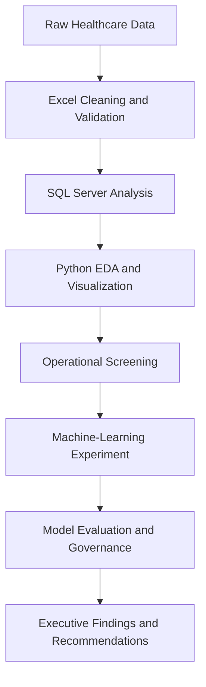

# Hospital Operations & Data Quality Analysis


## Executive Summary

This portfolio project analyzes **54,966 cleaned hospital admission records** to evaluate operational activity, patient characteristics, billing performance, data quality, admission trends, and potential long-stay patterns.

I created an end-to-end analytical workflow using **Microsoft Excel, SQL Server, Python, Pandas, Matplotlib, and scikit-learn**. The workflow preserves the original data, removes exact duplicates, validates important fields, flags unreliable billing records, produces decision-ready visualizations, creates a rule-based operational review process, and evaluates a machine-learning model.

The original dataset contained **55,500 records**. During data preparation, **534 exact duplicate rows** were removed, leaving **54,966 cleaned records**. An additional **106 zero or negative billing records** were flagged for review and excluded from valid financial calculations. The final dataset contained **54,860 valid billing records**, producing a **99.81% billing-quality pass rate**.

Python analysis confirmed the main Excel and SQL results. A rule-based operational screening process identified **1,908 high-attention records**, representing **3.47%** of all admissions. A logistic-regression experiment was also developed to predict long hospital stays. However, the model produced a **ROC-AUC of 0.513**, showing that the available synthetic features did not contain enough predictive information for deployment.

## Business Objective

The project was designed to answer the following questions:

* What is the overall volume of hospital admissions?
* Which medical conditions occur most frequently?
* Which admission types account for the most activity?
* Which conditions are associated with longer hospital stays?
* How are admissions distributed across insurance providers?
* Which conditions and insurers have higher average valid billing?
* Which records contain billing or other data-quality problems?
* How have hospital admissions changed over time?
* Which months have the highest and lowest admission activity?
* Which patient age groups account for the most admissions?
* Which records may require additional operational review?
* Can patient information available around admission predict a long hospital stay?
* What data limitations prevent reliable hospital, doctor, and predictive analysis?

## Dataset

The synthetic healthcare dataset contains patient-level hospital admission records, including:

* Patient age and gender
* Blood type
* Medical condition
* Admission and discharge dates
* Admission type
* Doctor and hospital
* Insurance provider
* Billing amount
* Room number
* Medication
* Test results
* Length of stay
* Data-quality validation fields

> **Privacy note:** This is a synthetic dataset. It does not contain real patient information or protected health information. The de-identified operational-review output excludes patient names, doctors, and hospital names.

## Analytical Workflow



## Tools and Skills Demonstrated

| Tool            | Work Completed                                                                                     |
| --------------- | -------------------------------------------------------------------------------------------------- |
| Microsoft Excel | Data cleaning, validation rules, audit checks, pivot tables, KPI cards, dashboard and slicers      |
| SQL Server      | Data import, validation, filtering, aggregation, reusable analytical view and KPI reconciliation   |
| Python          | Data loading, validation, exploratory analysis, feature engineering and export creation            |
| Pandas          | Grouping, filtering, aggregation, reshaping, quality checks and summary tables                     |
| Matplotlib      | Bar charts, horizontal bar charts, trend charts and model-evaluation visuals                       |
| scikit-learn    | Train/test split, preprocessing pipeline, baseline model, logistic regression and evaluation       |
| GitHub          | Version-controlled project documentation and portfolio presentation                                |
| Generative AI   | Code assistance, debugging, documentation drafting and executive interpretation under human review |

## Excel Analysis

Excel was used to create a transparent data-cleaning, validation, and reporting layer.

### Data Preparation

* Preserved the original dataset in a separate worksheet
* Removed **534 exact duplicate rows**
* Standardized field names for SQL compatibility
* Checked required fields for missing values
* Validated patient ages
* Validated room numbers
* Checked admission and discharge dates
* Calculated patient length of stay
* Validated admission-type categories
* Flagged zero and negative billing amounts
* Created an overall quality status for every record
* Preserved invalid records for audit purposes instead of overwriting them

### Data-Quality Fields

The cleaned workbook includes the following validation fields:

* `Age_Check`
* `Billing_Check`
* `Room_Check`
* `Date_Check`
* `Missing_Data_Check`
* `Category_Check`
* `Length_of_Stay`
* `Overall_Quality_Status`

### Excel Reporting

* Created a data-quality audit report
* Built pivot tables for medical conditions
* Analyzed admission types
* Analyzed insurance-provider distribution
* Compared average length of stay
* Reviewed billing by insurance provider
* Analyzed test-result distribution
* Created patient age groups
* Built KPI cards
* Added interactive slicers
* Developed an interactive hospital-operations dashboard
* Reconciled dashboard metrics with the cleaned dataset

## SQL Server Analysis

The cleaned data was imported into the `Healthcare_Analytics` database as `dbo.Healthcare_Data`. SQL Server Management Studio was used to validate the import and perform data-quality and business analysis.

### SQL Techniques Demonstrated

* `SELECT`
* `WHERE`
* `CASE`
* `GROUP BY`
* `ORDER BY`
* `COUNT`
* `SUM`
* `AVG`
* `MIN`
* `MAX`
* Conditional aggregation
* Percentage calculations
* Window functions
* Date analysis using `YEAR()` and `MONTH()`
* Data-type validation with `TRY_CONVERT()`
* Top-N analysis
* Reusable analytical views

### Valid Billing View

The view `dbo.Valid_Healthcare_Data` excludes billing amounts less than or equal to zero from financial calculations while retaining the original records in the source table for audit and review.

This approach prevents invalid billing records from distorting:

* Total billing
* Average billing
* Condition-level billing
* Insurance-provider billing
* Other financial KPIs

## Python Analysis

Python was used to independently validate Excel and SQL results, conduct exploratory analysis, create visualizations, prepare operational features, and evaluate a machine-learning experiment.

### Python Data Validation

The Python analysis confirmed:

* **54,966 rows**
* **23 original columns**
* No missing values
* No exact duplicates in the cleaned dataset
* Correct date formats for admission and discharge dates
* Numeric formats for age, billing amount, room number, and length of stay
* **106 negative billing records**
* **54,860 valid billing records**
* **99.81% valid billing rate**

Column names were standardized into lowercase `snake_case` format to make the Python code consistent and readable.

Examples:

* `Billing _Amount` became `billing_amount`
* `Medical_ Condition` became `medical_condition`
* `Overall _quality _status` became `overall_quality_status`

### Python Exploratory Analysis

Python was used to analyze:

* Admissions by medical condition
* Average length of stay by condition
* Average valid billing by condition
* Admission-type distribution
* Monthly admission trends
* Admissions per calendar day
* Insurance-provider distribution
* Average valid billing by insurer
* Hospital-name fragmentation
* Data-quality status
* Age-group distribution
* Gender distribution
* Test-result distribution
* Numerical correlations
* High-cost billing records

### Python Visualizations

The notebook includes:

* Admissions by medical condition
* Average length of stay by condition
* Average valid billing by condition
* Admissions by admission type
* Monthly hospital admissions trend
* Corrected
* Monthly admissions with incomplete months removed
* Admissions by insurance provider
* Patient distribution by age group
* Operational attention-level distribution
* Long-stay model confusion matrix

## Key Performance Indicators

| KPI                                            |            Result |
| ---------------------------------------------- | ----------------: |
| Original records                               |            55,500 |
| Exact duplicates removed                       |               534 |
| Cleaned records                                |            54,966 |
| Valid billing records                          |            54,860 |
| Invalid billing records                        |               106 |
| Billing-quality pass rate                      |            99.81% |
| Average patient age                            |       51.54 years |
| Patient age range                              |       13–89 years |
| Average length of stay                         |        15.50 days |
| Average valid billing                          |        $25,594.63 |
| Total valid billing                            | $1,404,121,601.31 |
| Analysis period                                | May 2019–May 2024 |
| Average monthly admissions for complete months | Approximately 917 |
| High-attention records                         |             1,908 |
| High-attention rate                            |             3.47% |

## Business Findings

### 1. Medical Conditions

Admissions were distributed relatively evenly across the six medical conditions.

| Medical Condition | Admissions |
| ----------------- | ---------: |
| Arthritis         |      9,218 |
| Diabetes          |      9,216 |
| Hypertension      |      9,151 |
| Obesity           |      9,146 |
| Cancer            |      9,140 |
| Asthma            |      9,095 |

* Arthritis had the highest number of admissions.
* Asthma had the lowest number of admissions.
* The difference between the highest and lowest conditions was only 123 admissions.

### 2. Length of Stay

| Medical Condition | Average Stay |
| ----------------- | -----------: |
| Asthma            |   15.68 days |
| Arthritis         |   15.50 days |
| Cancer            |   15.50 days |
| Obesity           |   15.45 days |
| Hypertension      |   15.44 days |
| Diabetes          |   15.43 days |

Asthma had the longest average stay. However, the difference between the highest and lowest condition averages was only **0.25 days**, so the variation was operationally small.

### 3. Admission Types

| Admission Type | Admissions | Percentage |
| -------------- | ---------: | ---------: |
| Elective       |     18,473 |     33.61% |
| Urgent         |     18,391 |     33.46% |
| Emergency      |     18,102 |     32.93% |

All three admission types represented approximately one-third of total admissions.

### 4. Valid Billing by Medical Condition

| Medical Condition | Average Valid Billing |
| ----------------- | --------------------: |
| Obesity           |            $25,859.22 |
| Diabetes          |            $25,714.33 |
| Asthma            |            $25,685.39 |
| Hypertension      |            $25,559.84 |
| Arthritis         |            $25,542.90 |
| Cancer            |            $25,205.92 |

* Obesity had the highest average valid billing.
* Cancer had the lowest average valid billing.
* The difference was **$653.30**, indicating relatively limited variation.

### 5. Insurance-Provider Distribution

| Insurance Provider | Admissions | Percentage |
| ------------------ | ---------: | ---------: |
| Cigna              |     11,139 |     20.27% |
| Medicare           |     11,039 |     20.08% |
| UnitedHealthcare   |     11,014 |     20.04% |
| Blue Cross         |     10,952 |     19.93% |
| Aetna              |     10,822 |     19.69% |

Insurance coverage was distributed almost evenly across the five providers.

### 6. Average Valid Billing by Insurance Provider

| Insurance Provider | Average Valid Billing |
| ------------------ | --------------------: |
| Medicare           |            $25,678.09 |
| Blue Cross         |            $25,639.27 |
| Aetna              |            $25,615.26 |
| Cigna              |            $25,582.23 |
| UnitedHealthcare   |            $25,458.89 |

The difference between the highest and lowest insurer averages was only **$219.20**, indicating relatively consistent billing across insurers.

### 7. Test Results

| Test Result  | Records | Percentage |
| ------------ | ------: | ---------: |
| Abnormal     |  18,437 |     33.54% |
| Normal       |  18,331 |     33.35% |
| Inconclusive |  18,198 |     33.11% |

Test outcomes were distributed almost equally across the three categories.

### 8. Gender Distribution

| Gender | Records | Percentage |
| ------ | ------: | ---------: |
| Male   |  27,496 |     50.02% |
| Female |  27,470 |     49.98% |

The gender distribution was almost exactly balanced.

### 9. Patient Age Groups

| Age Group | Patients | Percentage |
| --------- | -------: | ---------: |
| Under 18  |      116 |      0.21% |
| 18–34     |   13,485 |     24.53% |
| 35–49     |   12,154 |     22.11% |
| 50–64     |   12,288 |     22.36% |
| 65+       |   16,923 |     30.79% |

Patients aged 65 and older represented the largest group.

### 10. Monthly Admission Trends

The original monthly trend covered **61 calendar months**, from May 2019 through May 2024.

May 2019 and May 2024 were incomplete months:

* First admission date: May 6, 2019
* Last admission date: May 31, 2024

These incomplete periods were excluded from the corrected monthly trend to prevent misleading comparisons.

For complete months:

* Average monthly admissions: approximately **917**
* Highest monthly total: **August 2020 — 1,003 admissions**
* Lowest monthly total: **February 2022 — 772 admissions**
* Highest adjusted daily rate: **August 2020 — 32.35 admissions per day**
* Lowest adjusted daily rate: **February 2022 — 27.57 admissions per day**

Adjusting for days in each month confirmed that February 2022 remained the lowest-activity month.

### 11. Hospital-Name Fragmentation

The dataset contained **39,876 unique hospital names**. The ten most frequently recorded hospital names represented only **0.65%** of total admissions.

Names such as `LLC Smith`, `Smith LLC`, `Ltd Smith`, and `Smith Ltd` demonstrate possible entity-standardization problems.

Hospital workload rankings should not be treated as reliable without:

* Standardized hospital names
* Verified hospital identifiers
* A hospital master-data table
* Entity-resolution rules

### 12. Correlation Analysis

Correlations between age, billing amount, and length of stay were all close to zero.

| Variables                         | Correlation |
| --------------------------------- | ----------: |
| Age and billing amount            |      -0.003 |
| Age and length of stay            |       0.008 |
| Billing amount and length of stay |      -0.005 |

The dataset does not show meaningful linear relationships among these variables. No causal conclusions should be made from these results.

## High-Cost Record Analysis

High-cost records were defined as valid billing amounts at or above the **95th percentile**.

* High-cost threshold: **$47,641.28**
* High-cost records: **2,743**
* Share of valid billing records: approximately **5%**

### High-Cost Rate by Condition

| Medical Condition | Valid Records | High-Cost Records | High-Cost Rate |
| ----------------- | ------------: | ----------------: | -------------: |
| Hypertension      |         9,131 |               474 |          5.19% |
| Asthma            |         9,077 |               462 |          5.09% |
| Arthritis         |         9,207 |               465 |          5.05% |
| Obesity           |         9,127 |               460 |          5.04% |
| Diabetes          |         9,197 |               463 |          5.03% |
| Cancer            |         9,121 |               419 |          4.59% |

Hypertension had the highest high-cost rate, while Cancer had the lowest. The difference was only **0.60 percentage points**, so it should be treated as a small variation.

## Operational Attention Screening

A transparent rule-based screening process was created to identify records that may require additional operational review.

One point was assigned for each condition:

* Emergency admission
* Abnormal test result
* Length of stay greater than 23 days
* Billing amount at or above $47,641.28

### Attention Categories

* **Low:** Score of 0
* **Medium:** Score of 1 or 2
* **High:** Score of 3 or 4

| Attention Level | Records | Percentage |
| --------------- | ------: | ---------: |
| Low             |  17,831 |     32.44% |
| Medium          |  35,227 |     64.09% |
| High            |   1,908 |      3.47% |

The **1,908 high-attention records** were exported to `Python/high_attention_records.csv`.

The exported file excludes patient names, doctors, and hospital names.

> This score is intended only for portfolio-based operational analysis. It is not a validated clinical-risk score and must not be used to make medical decisions.

## Machine-Learning Experiment

A balanced logistic-regression model was created to evaluate whether variables available around admission could predict a long hospital stay.

### Target Variable

A long stay was defined as more than **23 days**, based on the dataset’s 75th percentile.

* Not-long-stay records: **42,186**
* Long-stay records: **12,780**

### Model Features

The model used:

* Age
* Gender
* Blood type
* Medical condition
* Admission type
* Insurance provider

Billing amount and discharge date were excluded because they would not be reliably known at admission and could create data leakage.

### Train/Test Split

* Training records: **43,972**
* Testing records: **10,994**
* Training share: 80%
* Testing share: 20%
* Stratified split used to preserve the target distribution
* `random_state=42` used for reproducibility

### Models Evaluated

1. Majority-class baseline
2. Balanced logistic regression

### Model Results

| Model                        | Accuracy | Long-Stay Precision | Long-Stay Recall | Long-Stay F1 | ROC-AUC |
| ---------------------------- | -------: | ------------------: | ---------------: | -----------: | ------: |
| Majority-Class Baseline      |    0.768 |               0.000 |            0.000 |        0.000 |   0.500 |
| Balanced Logistic Regression |    0.506 |               0.240 |            0.518 |        0.328 |   0.513 |

### Confusion Matrix

| Actual / Predicted | Not Long Stay | Long Stay |
| ------------------ | ------------: | --------: |
| Not Long Stay      |         4,237 |     4,201 |
| Long Stay          |         1,232 |     1,324 |

The logistic-regression model:

* Correctly identified 1,324 long-stay cases
* Missed 1,232 long-stay cases
* Incorrectly flagged 4,201 not-long-stay cases
* Produced a ROC-AUC of only 0.513

### Model Decision

The model should **not be deployed**.

The available synthetic features contain very little predictive signal. The high baseline accuracy was caused by class imbalance and did not indicate real predictive performance because the baseline failed to identify any long-stay cases.

A reliable model would require additional features such as:

* Diagnosis severity
* Comorbidities
* Prior hospital utilization
* Clinical procedures
* Laboratory measurements
* Staffing levels
* Bed availability
* Discharge barriers
* Social determinants of health
* Stable patient and admission identifiers

The model results were retained as an example of responsible model evaluation and governance. A weak model should be documented and rejected instead of being presented as successful.

## AI-Assisted Workflow and Governance

Generative AI was used as a coding and documentation assistant.

### AI-Assisted Tasks

* Drafting Python and SQL code
* Explaining code in beginner-friendly language
* Debugging code and warning messages
* Suggesting data-quality tests
* Structuring exploratory analysis
* Drafting visualization code
* Supporting feature-engineering ideas
* Drafting executive findings
* Organizing project documentation

### Human Responsibilities

* Validating all formulas and calculations
* Confirming table and column names
* Running and testing every code block
* Comparing Python results with SQL and Excel
* Reviewing data-quality logic
* Checking for data leakage
* Evaluating model performance
* Rejecting the weak model
* Confirming business interpretations
* Approving final recommendations

Excel, SQL, and Python outputs remain the source of truth. AI-generated content was reviewed and validated before inclusion.

## Recommendations

### Data Quality

* Route zero and negative billing records to a billing-review queue before financial reporting.
* Calculate financial KPIs using validated billing records.
* Preserve invalid records for audit purposes rather than deleting or overwriting them.
* Automate checks for missing values, invalid dates, implausible ages, invalid room numbers, and category inconsistencies.
* Add a unique `Admission_ID` during data ingestion.
* Add stable `Patient_ID`, `Hospital_ID`, and `Doctor_ID` fields.
* Maintain hospital and doctor master-data tables.
* Apply standardized naming and entity-resolution rules.

### Hospital Operations

* Review the factors contributing to lower admission activity in February 2022.
* Use daily admission rates when comparing months with different numbers of days.
* Monitor the 65+ population because it represents the largest patient group.
* Review high-attention records through an operational workflow.
* Investigate long-stay cases using additional clinical and discharge-planning data.

### Predictive Analytics

* Do not deploy the current long-stay model.
* Collect stronger clinical and operational predictors.
* Establish a clinically meaningful target definition.
* Compare future models against simple baselines.
* Evaluate precision, recall, F1-score, ROC-AUC, and operational impact.
* Require stakeholder review and validation before deployment.

## Dashboard Preview

### Hospital Operations Overview


### Data Quality and Detailed Analysis


## Repository Structure

```text
Hospital_operations_Analysis/
├── Data/
│   ├── Raw_Data/
│   └── Cleaned_Data/
│       └── healthcare_cleaned_data.csv
├── Excel/
│   ├── healthcare_cleaned_final.xlsx
│   └── Dashboard_Images/
│       ├── dashboard_overview.png
│       └── dashboard_details.png
├── SQL/
│   ├── hospital_operations_analysis.sql
│   └── sql_kpi_summary.csv
├── Python/
│   ├── Hospital_Operations_Python.ipynb
│   ├── high_attention_records.csv
│   ├── model_evaluation.csv
│   └── README.md
├── images/
│   ├── dashboard_overview.png
│   └── dashboard_details.png
└── README.md
```

## Project Deliverables

* Cleaned Excel workbook
* Original and cleaned data layers
* Data-quality validation columns
* Data-quality audit report
* Interactive Excel KPI dashboard
* Cleaned CSV for SQL Server
* Complete SQL analysis script
* Reusable valid-billing SQL view
* SQL KPI summary
* Python exploratory-analysis notebook
* Python data-quality validation
* Python charts and trend analysis
* De-identified high-attention review file
* Machine-learning experiment
* Model-evaluation CSV
* Confusion-matrix visualization
* Model-governance documentation
* Executive findings and recommendations
* Recruiter-ready GitHub documentation

## How to Reproduce the SQL Analysis

1. Open SQL Server Management Studio.
2. Create a database named `Healthcare_Analytics`.
3. Import `healthcare_cleaned_data.csv` as `dbo.Healthcare_Data`.
4. Open `SQL/hospital_operations_analysis.sql`.
5. Run the queries in sequence.
6. Create the `dbo.Valid_Healthcare_Data` view.
7. Compare the final results with `SQL/sql_kpi_summary.csv`.

## How to Reproduce the Python Analysis

1. Install Python or Anaconda.
2. Open Jupyter Notebook.
3. Place the cleaned Excel workbook in the same working folder as the notebook.
4. Open `Python/Hospital_Operations_Python.ipynb`.
5. Confirm that the workbook filename in `pd.read_excel()` matches the local file.
6. Run the notebook cells in order.
7. Compare the Python KPIs with the Excel and SQL results.
8. Review the exported `high_attention_records.csv`.
9. Review `model_evaluation.csv`.
10. Confirm that the machine-learning conclusion remains supported by the evaluation results.

## Project Status

* [x] Excel data cleaning and validation
* [x] Excel audit report
* [x] Excel dashboard and KPI reporting
* [x] SQL Server database and data import
* [x] SQL data-quality analysis
* [x] SQL business analysis
* [x] Reusable valid-billing SQL view
* [x] Python exploratory analysis
* [x] Python data validation
* [x] Python visualizations
* [x] Monthly trend correction
* [x] High-cost record analysis
* [x] Operational attention screening
* [x] Machine-learning experiment
* [x] Baseline comparison
* [x] Model evaluation
* [x] Model-governance conclusion
* [x] Cross-tool validation
* [x] Executive recommendations
* [x] GitHub portfolio documentation

## Limitations

* The dataset is synthetic, so findings should not be interpreted as real clinical or financial benchmarks.
* The dataset does not contain stable patient or admission identifiers.
* Reliable readmission analysis cannot be performed.
* The dataset contains 39,876 distinct hospital names, limiting provider-level analysis.
* Doctor and hospital names may contain inconsistent entity naming.
* Invalid billing records were flagged and excluded rather than overwritten.
* The dataset lacks diagnosis severity, comorbidities, procedures, prior utilization, staffing, and discharge-barrier information.
* Correlations among the main numerical variables were close to zero.
* The long-stay model performed only slightly better than random guessing.
* The rule-based attention score is not clinically validated.
* No model or operational score in this project should be used for real patient-care decisions.

## Portfolio Summary

This project demonstrates an end-to-end analytics workflow that combines data cleaning, quality controls, financial validation, SQL analysis, Python exploration, visualization, feature engineering, machine learning, governance, and executive communication.

The project also demonstrates an important professional principle: analytical value does not come from forcing a positive result. The long-stay model was evaluated against a baseline, found to be unreliable, and rejected with clear recommendations for improving the underlying data.
