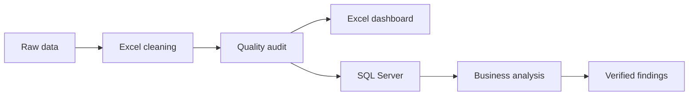

# Hospital Operations & Data Quality Analysis


## Executive Summary

This portfolio project analyzes **54,966 hospital admission records** to evaluate operational activity, patient characteristics, billing performance, and data quality. I built an auditable workflow in Microsoft Excel and SQL Server that preserves the source data, removes exact duplicates, validates critical fields, flags unreliable billing records, and converts the cleaned data into decision-ready insights.

The analysis identified **534 duplicate records** and **106 invalid billing records**. After excluding zero and negative billing amounts from financial calculations, the dataset contained **54,860 valid billing records**, representing a **99.81% data-quality pass rate**.

## Business Objective

The project was designed to answer the following questions:

- What is the overall volume of hospital admissions?
- Which medical conditions and admission types occur most frequently?
- Which conditions are associated with longer hospital stays?
- How are admissions and billing distributed across insurance providers?
- Which records contain billing or other data-quality problems?
- How have admissions changed over time?
- Which hospitals and doctors have the highest recorded workloads?
- Which patient groups and admissions are associated with higher billing?

## Dataset

The synthetic healthcare dataset contains patient-level hospital admission records with patient demographics, medical conditions, admission details, providers, insurance coverage, test results, and billing amounts.

> **Privacy note:** The dataset is synthetic and does not contain real patient information or protected health information.

## Analytical Workflow



## Excel Analysis

Excel was used to create a transparent cleaning, validation, and reporting layer.

### Data preparation

- Preserved the original dataset in a separate worksheet
- Removed **534 exact duplicate rows**
- Standardized field names for SQL compatibility
- Verified required fields for missing values
- Validated age, room number, admission date, and discharge date
- Calculated patient length of stay
- Validated admission-type categories
- Flagged zero and negative billing amounts
- Assigned each record an overall quality status

### Reporting

- Created a data-quality audit report
- Built pivot tables for conditions, admission types, insurers, length of stay, and test results
- Developed KPI cards and an interactive hospital-operations dashboard
- Reconciled dashboard metrics with the cleaned dataset

## SQL Server Analysis

The cleaned CSV was imported into the `Healthcare_Analytics` database as `dbo.Healthcare_Data`. SQL Server Management Studio was used to validate the import and perform exploratory and business analysis.

### SQL techniques demonstrated

- `SELECT`, `WHERE`, `CASE`, `GROUP BY`, and `ORDER BY`
- `COUNT`, `SUM`, `AVG`, `MIN`, and `MAX`
- Conditional aggregation for valid and invalid records
- Percentage calculations using window functions
- Date analysis using `YEAR()` and `MONTH()`
- Data-type conversion with `TRY_CONVERT()`
- Top-N analysis
- Reusable analytical views

The view `dbo.Valid_Healthcare_Data` excludes records with billing amounts less than or equal to zero from financial calculations while retaining the original records for audit purposes.

## Key Results

| KPI | Result |
|---|---:|
| Original records | 55,500 |
| Exact duplicates removed | 534 |
| Cleaned records | 54,966 |
| Valid billing records | 54,860 |
| Invalid billing records | 106 |
| Data-quality pass rate | 99.81% |
| Average patient age | 51.54 years |
| Patient age range | 13–89 years |
| Average length of stay | 15.50 days |
| Average valid billing | $25,594.63 |
| Total valid billing | $1,404,121,601.31 |
| Analysis period | May 2019–May 2024 |

## Business Findings

1. **Medical conditions were evenly distributed.** Arthritis had the most admissions at **9,218**, while asthma had the fewest at **9,095**.
2. **Asthma had the longest average hospital stay**, at approximately **15.68 days**.
3. **Elective admissions were the largest admission category**, with **18,473 records (33.61%)**. Urgent and emergency admissions were also close to one-third each.
4. **Test outcomes were balanced:** 18,437 abnormal, 18,331 normal, and 18,198 inconclusive results.
5. **Billing required a separate validation rule.** The 106 zero or negative billing records would understate financial KPIs if included without review.
6. **Admission activity covers 61 calendar months**, enabling monthly trend analysis from May 2019 through May 2024.

## Recommendations

- Route zero and negative billing records to a billing-review queue before financial reporting.
- Calculate billing KPIs from the validated SQL view rather than the unfiltered table.
- Maintain automated checks for missing values, invalid dates, implausible ages, and category inconsistencies.
- Add a unique `Admission_ID` during future data ingestion to improve record tracking and database design.
- Use standardized hospital and doctor identifiers in future datasets because names alone can create grouping problems.

## Repository Structure

```text
Hospital_operations_Analysis/
├── Data/
│   ├── Raw_Data/
│   └── Cleaned_Data/
│       └── healthcare_cleaned_data.csv
├── Excel/
│   ├── healthcare_cleaned_final.xlsx
│   └── Dashboard_Images/
│       ├── dashboard_overview.png
│       └── dashboard_details.png
├── SQL/
│   ├── hospital_operations_analysis.sql
│   └── sql_kpi_summary.csv
├── Python/
└── README.md
```

## How to Reproduce the SQL Analysis

1. Open SQL Server Management Studio.
2. Create a database named `Healthcare_Analytics`.
3. Import `healthcare_cleaned_data.csv` into `dbo.Healthcare_Data`.
4. Open `SQL/hospital_operations_analysis.sql`.
5. Run the queries in sequence.
6. Compare the final KPI output with `SQL/sql_kpi_summary.csv`.

## Project Deliverables

- Cleaned Excel workbook with validation columns
- Data-quality audit report and Excel KPI dashboard
- Cleaned CSV for SQL import
- Complete SQL analysis script
- Exported SQL KPI summary
- Professional project documentation

## Project Status

- [x] Excel data cleaning and validation
- [x] Excel dashboard and KPI reporting
- [x] SQL Server database and data import
- [x] SQL data-quality and business analysis
- [ ] Python exploratory analysis and visualizations
- [ ] Final cross-tool recommendations

## Limitations

- This is a synthetic dataset; findings should not be interpreted as real clinical or financial benchmarks.
- The dataset contains many distinct hospital and doctor names, limiting the operational meaning of provider-level rankings.
- The data does not include stable patient or admission identifiers, preventing reliable readmission analysis.
- Invalid billing records were flagged and excluded from valid financial metrics rather than overwritten.

## Author

**Maheshwari Swamy**  
Data Analytics Portfolio Project
